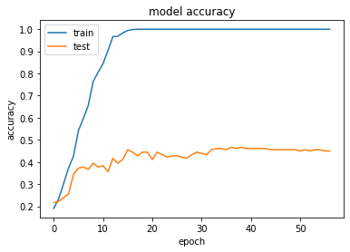

# Plant-s_Leaf_counting_using_VGG16

## Overview
A Deep Learning Case Study that aims at automating the tedious task of observing Plant Phenotypes(leaves in this case). Given a plant image, it can predict the leaf count which can help monitor the health and growth of the plants. The approach involved using various Deep Learning technqiues using Segmentation models, Convolutional models for Regression and Transfer Learning models for predicting the leaf count.

## Dataset (Leaf counting dataset):

Description: The dataset is plant images at different resolutions captured with a variety of cameras. There are images showing plants with approximatelty 1,2,3,4 and 6 leafs. The images are part of a Leaf counting dataset which can be downloaded from the Aarhus University, Denmark.
Link to download: you can download the dataset from the original website here [Original data](https://vision.eng.au.dk/leaf-counting-dataset/)

you can download the splitted folders for train and test from here [Splitted version](https://vision.eng.au.dk/leaf-counting-dataset/).

## Methodology

## Results and conclusion:

### Compare the classification and regression
**Mentoring Curves**

|                              | Accuracy Curve | Loss Curve              |
|------------------------------|------------------------|-------------------------|
| **Part1 a (Classification)** |  |  |
| **Part1 b (Regression)**     |  |  |

**As shown in the table below:**

|                              | Training accuracy   | Validation accuracy   |    Testing accuracy  |
|------------------------------|---------------------|-----------------------|----------------------|
| **Part1 a (Classification)** | 100%                | 46%                   |          43%         |
| **Part1 b (Regression)**     | 64%                 | 32.7%                 |          31%         |

**Confusion matrices**

|                              | Training Metrix         | Validation Metrix       | Testing Metrix           |
|------------------------------|-------------------------|-------------------------|--------------------------|
| **Part1 a (Classification)** |  |  |   |
| **Part1 b (Regression)**     |  |  |  |

- **The first model which is in part1 a (classification):** the model is overfitting the training dataset as the training accuracy is much higher than the validation and testing accuracy, as the dataset is small and the model has no regularization or dropout layers to prevent the overfitting.
- **The second model which is in part 1 b (regression):** the model is slightly overfitting the training dataset as the training is much higher than the validation and testing accuracy, as the dataset is small and needs to be augmented.
- **The best model is the classification,** as it has the highest validation and testing accuracy.
- **Both models are overfitting,** due to the small size of the training set in addition to the absence of regularization, batch normalization, and augmentation in part one.
- **Finally,** we expect part 2 to be more generalized and the training accuracy to be reduced, and the validation, and testing accuracy to increase after adding the batch normalization, dropout, and increase in the training size using augmentation.

### Generalizing the models using regularization techniques

**Mentoring Curves**

|                              | Accuracy Curve           | Loss Curve               |
|------------------------------|--------------------------|--------------------------|
| **Part2 (regularization + batch normalization)** |  |  |
| **Part2 (regularization + batch normalization + data augmentation)**     |  |  |

**As shown in the figure below:**

|                                                                      | Training accuracy | Validation accuracy | Testing accuracy |
|----------------------------------------------------------------------|-------------------|---------------------|------------------|
| **Part1a (Classification)**                                          | 100%              | 46%                 | 43%              |
| **Part2 (regularization + batch normalization)**                     | 87%               | 55%                 | 44%              |
| **Part2 (regularization + batch normalization + data augmentation)** | 81%               | 66%                 | 55%              |

**Confusion matrices**
 
|                                                    | Training Metrix          | Validation Metrix        | Testing Metrix           |
|----------------------------------------------------|--------------------------|--------------------------|--------------------------|
| **Part2 (regularization + batch normalization)**   |  |  |  |
| **Part2 (regularization + batch normalization)**   |  |  |  |

**The above table fits our expectations as we discussed before in part1:**

- **The first experiment by adding some batch normalization and dropout layers:**
    - The model begins to generalize better as the training accuracy reduced from 100% to 87% while the validation and testing increased to 55% and 44%, so it's definitely a huge improvement.
    - Still has kind of overfitting, as training accuracy is 88% while the validation and testing are around 50% but the dropout and batch normalization help the model to generalize a bit.

- **The second experiment after augmenting the training set and retraining the regulized network we found:**
    - The model becomes more generalized as the training dataset has been increased, which allowed the model to learn better the different variations in the data such as zooming, rotation, and flipping.
    - The training accuracy decreased from 87% to 81%, while the validation and testing accuracy increased significantly to 66% and 55%, almost 11% improvement in both validation and testing accuracies.

- **Finally,** both regularization and augmentation helped the model to generalize better and reduced the overfitting, as the augmentation helped to increase the small size of the training set, and the regularization prevent the model's weight from overfitting.

# References:
[1] N. Teimouri, M. Dyrmann, P. R. Nielsen, S. K. Mathiassen, G. J. Somerville, and R. N. Jørgensen, “Weed growth stage estimator using deep convolutional neural networks,” Sensors, vol. 18, no. 5, 2018.
